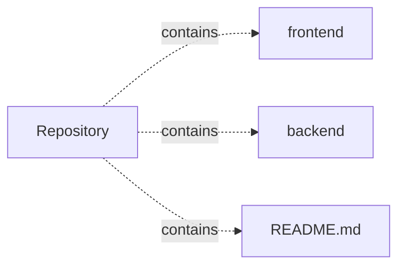

# project — project architecture

[README](README.md) · [Interview questions and answers](INTERVIEW_QA.md)

## Purpose and scope

A Spring Boot and React platform connecting users with hyperlocal government job opportunities and AI-powered assistance.

This document describes files and symbols in this checkout. Deployment templates and statements in the original overview are distinguished from a verified running environment.

## Component diagram



For Python repositories, arrows show resolved local imports, not network calls or deployment order. Otherwise the diagram is a repository component map; containment arrows do not assert runtime integration.

## Components and responsibilities

| Component | Responsibility |
| --- | --- |
| [`frontend/package.json`](frontend/package.json) | User interface code/assets |
| [`backend/src/main/java/com/naukrisetu/controller/AuthController.java`](backend/src/main/java/com/naukrisetu/controller/AuthController.java) | HTTP request handling |
| [`backend/src/main/java/com/naukrisetu/controller/DistrictController.java`](backend/src/main/java/com/naukrisetu/controller/DistrictController.java) | HTTP request handling |
| [`backend/src/main/java/com/naukrisetu/controller/DocumentController.java`](backend/src/main/java/com/naukrisetu/controller/DocumentController.java) | HTTP request handling |
| [`backend/src/main/java/com/naukrisetu/controller/JobApplicationController.java`](backend/src/main/java/com/naukrisetu/controller/JobApplicationController.java) | HTTP request handling |
| [`backend/src/main/java/com/naukrisetu/controller/JobController.java`](backend/src/main/java/com/naukrisetu/controller/JobController.java) | HTTP request handling |
| [`frontend/src/App.tsx`](frontend/src/App.tsx) | User interface code/assets |
| [`frontend/src/index.tsx`](frontend/src/index.tsx) | User interface code/assets |
| [`frontend/src/react-app-env.d.ts`](frontend/src/react-app-env.d.ts) | User interface code/assets |
| [`frontend/src/reportWebVitals.ts`](frontend/src/reportWebVitals.ts) | User interface code/assets |
| [`frontend/src/setupTests.ts`](frontend/src/setupTests.ts) | User interface code/assets |
| [`frontend/src/components/Layout.tsx`](frontend/src/components/Layout.tsx) | User interface code/assets |
| [`frontend/src/hooks/useAuth.tsx`](frontend/src/hooks/useAuth.tsx) | User interface code/assets |
| [`frontend/src/pages/Documents.tsx`](frontend/src/pages/Documents.tsx) | User interface code/assets |
| [`backend/pom.xml`](backend/pom.xml) | Implementation or supporting configuration |
| [`frontend/src/App.test.tsx`](frontend/src/App.test.tsx) | Executable checks and regression examples |
| [`README.md`](README.md) | Project explanations or operating notes |
| [`backend/README.md`](backend/README.md) | Project explanations or operating notes |
| [`frontend/README.md`](frontend/README.md) | User interface code/assets |

## JavaScript/TypeScript execution contracts

| Manifest | Script | Command defined by the project |
| --- | --- | --- |
| [`frontend/package.json`](frontend/package.json) | `start` | `react-scripts start` |
| [`frontend/package.json`](frontend/package.json) | `build` | `react-scripts build` |
| [`frontend/package.json`](frontend/package.json) | `test` | `react-scripts test` |
| [`frontend/package.json`](frontend/package.json) | `eject` | `react-scripts eject` |

Run a script from the directory containing its manifest. Script names are package contracts; their presence does not show that their dependencies are installed or that they pass.

## Data flow and design decisions

### What does `frontend/src/App.tsx` own

[`frontend/src/App.tsx`](frontend/src/App.tsx) defines the module setup. Its imports include `react`, `react-router-dom`, `@mui/material`, `./hooks/useAuth`, `./components/Layout`, `./pages/Home`, `./pages/Login`, `./pages/Register`, `./pages/Profile`, `./pages/Documents`.

Trace these definitions and imports to explain the module boundary. Relative imports identify project code; package imports should be checked against the nearest manifest.

### What does `frontend/src/index.tsx` own

[`frontend/src/index.tsx`](frontend/src/index.tsx) defines the module setup. Its imports include `react`, `react-dom/client`, `@mui/material/CssBaseline`, `./App`, `./reportWebVitals`.

Trace these definitions and imports to explain the module boundary. Relative imports identify project code; package imports should be checked against the nearest manifest.

### How are the Spring HTTP controllers organized

- [`backend/src/main/java/com/naukrisetu/controller/AuthController.java`](backend/src/main/java/com/naukrisetu/controller/AuthController.java): `@RequestMapping("/api/auth")`, `@PostMapping("/login")`, `@PostMapping("/signup")`; fields use `AuthenticationManager`, `UserRepository`, `RoleRepository`, `PasswordEncoder`, `JwtTokenProvider`.
- [`backend/src/main/java/com/naukrisetu/controller/DistrictController.java`](backend/src/main/java/com/naukrisetu/controller/DistrictController.java): `@RequestMapping("/api/districts")`, `@GetMapping("/{id}")`, `@GetMapping("/states")`, `@PutMapping("/{id}")`, `@DeleteMapping("/{id}")`, `@GetMapping("/stats")`; fields use `DistrictRepository`.
- [`backend/src/main/java/com/naukrisetu/controller/DocumentController.java`](backend/src/main/java/com/naukrisetu/controller/DocumentController.java): `@RequestMapping("/api/documents")`, `@PostMapping("/upload")`, `@GetMapping("/user/{userId}")`, `@GetMapping("/{id}")`, `@DeleteMapping("/{id}")`, `@PutMapping("/{id}/verify")`; fields use `DocumentRepository`, `UserRepository`, `Path`.
- [`backend/src/main/java/com/naukrisetu/controller/JobApplicationController.java`](backend/src/main/java/com/naukrisetu/controller/JobApplicationController.java): `@RequestMapping("/api/applications")`, `@PostMapping("/jobs/{jobId}/apply")`, `@GetMapping("/user/{userId}")`, `@GetMapping("/job/{jobId}")`, `@PutMapping("/{id}/status")`, `@PostMapping("/offline-submit")`; fields use `JobApplicationRepository`, `JobRepository`, `UserRepository`.
- [`backend/src/main/java/com/naukrisetu/controller/JobController.java`](backend/src/main/java/com/naukrisetu/controller/JobController.java): `@RequestMapping("/api/jobs")`, `@GetMapping("/search")`, `@GetMapping("/{id}")`, `@PutMapping("/{id}")`, `@DeleteMapping("/{id}")`, `@GetMapping("/nearby")`; fields use `JobRepository`.
- [`backend/src/main/java/com/naukrisetu/controller/ReferralController.java`](backend/src/main/java/com/naukrisetu/controller/ReferralController.java): `@RequestMapping("/api/referrals")`, `@PostMapping("/jobs/{jobId}/refer")`, `@GetMapping("/user/{userId}")`, `@GetMapping("/job/{jobId}")`, `@PutMapping("/{id}/status")`, `@GetMapping("/stats/user/{userId}")`; fields use `ReferralRepository`, `UserRepository`, `JobRepository`.

Class-level request mappings combine with method-level mappings. Follow injected fields to identify the service/repository layer and inspect security configuration separately.

## Setup and verification

The following commands are derived from the checked-in dependency/test contracts. Execute them from the repository root; the block prepares a local environment, not a cloud deployment.

```bash
cd frontend
npm install
npm test
npm run start
```

Test entry points: [`frontend/src/App.test.tsx`](frontend/src/App.test.tsx).

## Operating boundaries and design review

Before turning this checkout into a customer deployment, establish the input contract, data ownership, access controls, failure response, evaluation criteria, and rollback owner. Repository fixtures and unit tests demonstrate local behavior; they do not establish throughput, uptime, compliance, or business impact.

A useful architecture review starts with the linked implementation: identify where input enters, where a decision is made, which state can change, and which external dependency can fail. Add a deployment view only for infrastructure that is actually configured and exercised.
